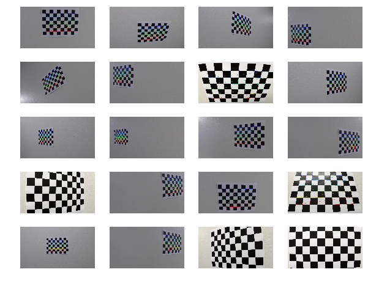
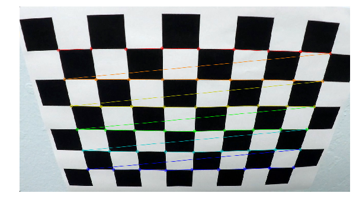
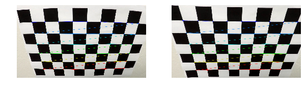
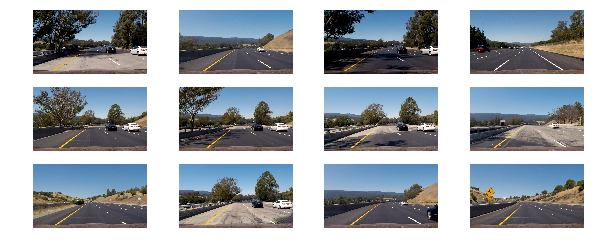
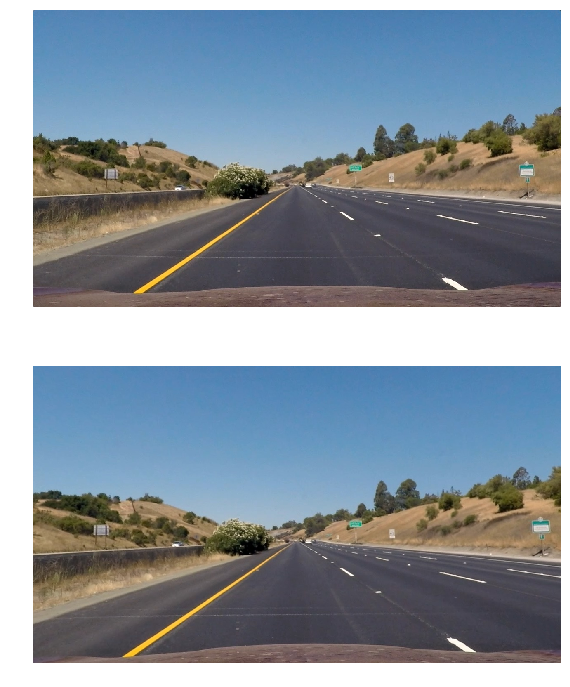
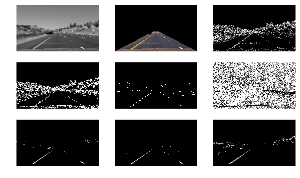
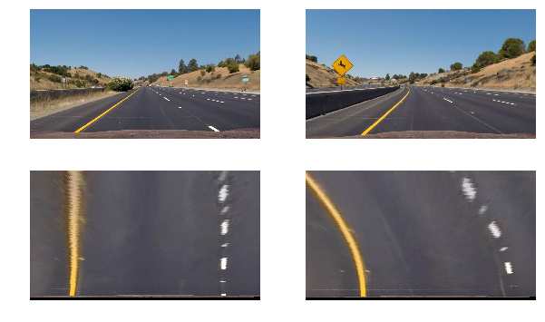
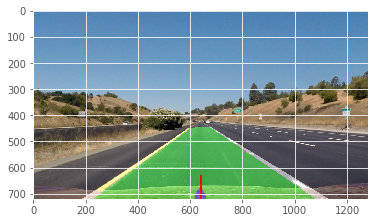
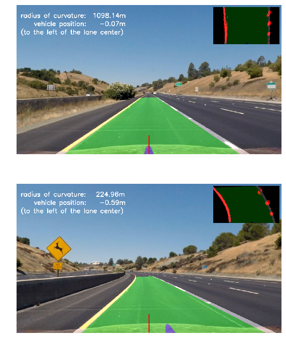

# Advanced Line Finding

# Camera Calibration

First I load the calibration images and confirm that the chessboard pattern has valid 9x6 corners.

Then I proceed to extract the `object points` and `image points` that I need to calculate the `camera matrix` and `distortion coefficients`:



Here is an example of the chessboard corners identified in one of the calibration images:



I also notice that on 3 images OpenCV didn't extract the corners. Those images had missing some of the corners and were not detected by OpenCV.


# Distortion Correction

Using the `object points` and `image points` I calculate the camera matrix `mtx` and distortion coefficients `dist`:

```python
w = image_shape[1]
h = image_shape[0]

image_size = (w, h)

ret, mtx, dist, rvecs, tvecs = cv2.calibrateCamera(objectPoints=object_points,
                                                   imagePoints=image_points,
                                                   imageSize=image_size,
                                                   cameraMatrix=None,
                                                   distCoeffs=None)
```

I use those values to undistort our images. Here it is side by side the original and undistorted calibration image:





Using our sample images:





An original image and the same one undistorted:





# Threshold Binary Image

I proceed to define several transformations that will help me to generate a thresholded binary image.

A summary of the methods used for testing:

```python
def grayscale(image):
def mask(image):
def abs_sobel_thresh(gray, orient='x', thresh_min=0, thresh_max=255):
def mag_thresh(gray, sobel_kernel=3, thresh=(0, 255)):
def dir_thresh(gray, sobel_kernel=3, thresh=(0, np.pi/2)):
def hls_select(image, thresh=(0, 255)):
def hsv_white(image):
def hsv_yellow(image):
```

The code is in lines #107-#215 in `advanced_line_finding.py`

An example of each of those methods:



After a process of trial and error I found that the following pipeline works well for the original video:

```python
def pipeline(image):
    gray = grayscale(image)
    masked = mask(gray)
    magnitude = mag_thresh(gray, sobel_kernel=9, thresh=(100, 255))
    direction = dir_thresh(gray, sobel_kernel=15, thresh=(0.19, 1.37))
    yellow = hsv_yellow(image)
    white = hsv_white(image)

    binary_output = ((masked > 0) &
                     (((magnitude == 1) & (direction == 1)) | yellow | white))

    return binary_output
```

# Calculate Mapping Points

Using a sample image with almost parallel lines, I manually extracted the coordinates and for both source `src` and destination `dst`:

```python
src = np.float32(
    [[748, 490],
     [1073, 700],
     [235, 700],
     [540, 494]])

dst = np.float32(
    [[1080, 490],
     [1073, 700],
     [235, 700],
     [270, 490]])
```

Using those mapping points to warp the perspective in our samples:



The binary output looks like this:


# Detect Lane Lines

To detect the lines I follow the procedure from the lectures using a histogram and stacked windows to identify the position of the pixels that could belong to a lane line.

After those points have been identified and separated in 2 groups, left line and right line, I proceeded to fit a polynomial of degree 2.

The code is in lines #292-#391 in `advanced_line_finding.py`.


A complete example look like this:




# Measuring Curvature

To measure the curvature I used the equation and values to convert from pixels to meters from the lecture to calculate the curvature:

```python
    # Define conversions in x and y from pixels space to meters
    ym_per_pix = 30/720   # meters per pixel in y dimension
    xm_per_pix = 3.7/700  # meters per pixel in x dimension
```

To calculate the position of the vehicle, I did simple calculation assuming that the camera is right in the center of the vehicle.

From the 2 polynomials, I extracted the points of the bottom of the image and use those to get the center of the lane. The difference between the center of the lane and the center of the image (camera position) is the offset of the vehicle with respect to the center. The code is in lines #503-#518.

The final processing looks like this:



The vertical red line indicates the center of the image, and the blue mark indicates the center of the lane.

The overlay in the top right show the perpective tranformation including the binary output.


# Pipeline

Here is a link to the final video [project_video_output.mp4](project_video_output.mp4).

The video processing time was under 3 minutes:

```
    CPU times: user 3min 10s, sys: 4.38 s, total: 3min 14s
    Wall time: 2min 31s
```

# Discussion

I think the most time consuming part of the process was trying to find the best parameters for the pipeline that filter the image good enough to leave most of the lane lines visible.

The lighting changes; shadows and very bright sections of the road presented a real challenge. The pipeline will work most of the time, but fail when crossing a darker or brighter area. HSV and HLS really helped to deal with these conditions.

The smoothing using values from previous frames is required. Without that the lane lines overlay jitters too much.

My current pipeline really depends on the lighting conditions. It will not work well at night.
I can think of a more robust approach if we can modify dynamically the parameters of the pipeline according to the lightning conditions.
